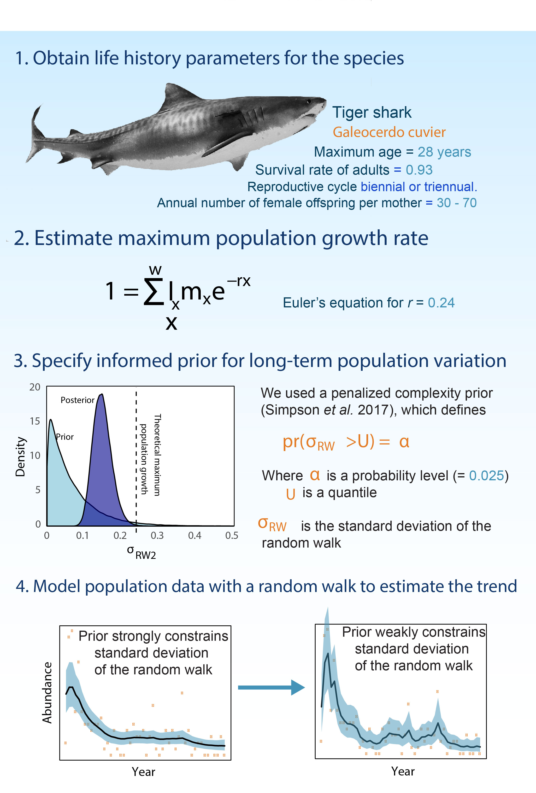

# Code for "Life-history traits inform population trends when assessing the conservation status of a declining tiger shark population"

Citation: [Brown CJ, Roff G. Life-history traits inform population trends when assessing the conservation status of a declining tiger shark population. Biological Conservation. 2019 Nov 1;239:108230.](https://www.sciencedirect.com/science/article/pii/S0006320719306020?casa_token=1MetIYRF2X4AAAAA:5JqOjGn4IdWHEpIy5Mou283nUip6WDWGFE4W0qAjzmXQBR-RdsC5o6MDuqa9Vo-3KAE2YBDb)
([pre-print on biorxiv](https://www.biorxiv.org/content/10.1101/395509v4.full))

The paper fits Bayesian generalized additive models (using a random walk) and shows how we can relate the variance of the random walk (which controls its 'wiggiliness') to shark life-history traits.

This repo includes code for the simulation study described in the above paper, core functions for fitting Bayesian GAMMs to the shark population data and a script that fits the models.

Unfortunately we do not have a license to provide the data here, more details on the data are in the paper. The simulation-study script is stand-alone, and will run without any data (it generates it's own).

### Overview of the method

## Key scripts

### sharks-functions.R

Has functions to fit the GAMMs to spatio-temporal population data.

### simulation-study.R

Simulates data and fits models to it. This will run without any additional data files

### sharks-effects-of-priors-V4-AR1.R

Fits the AR1 model described in the paper. The model fitting is actually done within a function (see sharks-functions.R). This script loops over different subsets of the data to explore how data quantity affects fits and trend estimates.

### sharks-GAM-trends-v2.R

Fits the GAMMs described in the paper. Similar to above, but not Bayesian.

### plot-gam-results-v2.R

Makes the plots for the GAM fits.
